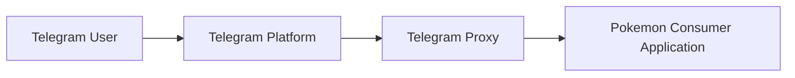
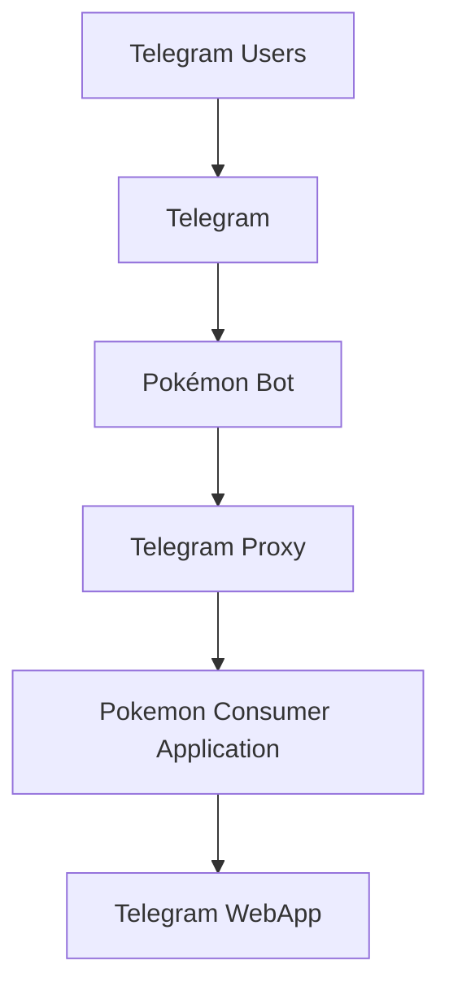
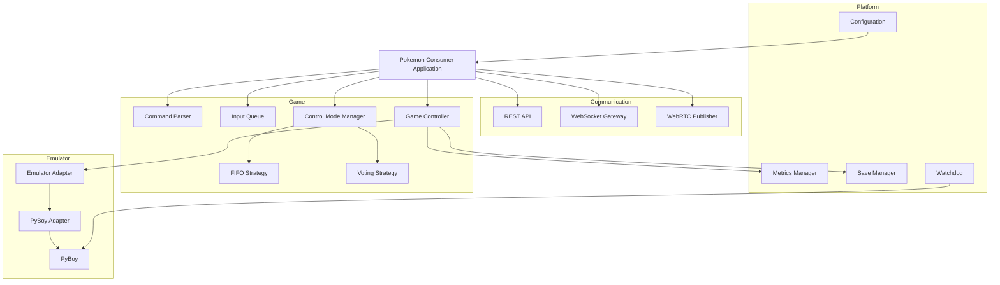
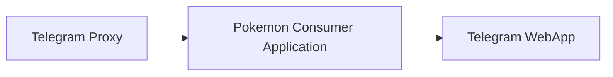

# Pokémon Yellow Community Play

## High Level Design (HLD)

| Property        | Value                |
| --------------- | -------------------- |
| Document        | High Level Design    |
| Version         | 1.0                  |
| Status          | Draft                |
| Target Platform | Raspberry Pi (ARM64) |
| Emulator        | PyBoy                |
| Frontend        | Telegram WebApp      |
| Language        | Python               |

---

# 1. Introduction

## 1.1 Purpose

This document describes the high-level architecture of the **Pokémon Yellow Community Play Platform**.

The platform enables multiple Telegram users to collaboratively play a single instance of **Pokémon Yellow** running on a Raspberry Pi. Users watch the gameplay through an embedded Telegram WebApp while sending game controls that are processed by a centralized backend.

The design emphasizes:

* Low latency
* Simplicity
* Maintainability
* Extensibility
* Docker-based deployment
* Emulator independence

This document intentionally focuses on the system architecture and major design decisions. Implementation details are described in the corresponding Low Level Design (LLD).

---

## 1.2 Background

The project originated as a Telegram-controlled Pokémon bot.

During the architectural design phase, the project evolved into a richer platform where Telegram acts primarily as the application launcher and authentication provider.

The actual gameplay experience is provided by a Telegram WebApp that embeds:

* Live video
* Virtual controller
* Game status
* Statistics

As a result, the platform is better described as a **Telegram-embedded collaborative gaming application** than as a traditional Telegram bot.

---

## 1.3 Goals

The platform shall:

* Execute Pokémon Yellow on ARM hardware.
* Allow multiple users to control the same game simultaneously.
* Stream gameplay with minimal latency.
* Support multiple input strategies.
* Persist game progress automatically.
* Collect gameplay statistics.
* Provide operational monitoring.
* Be deployable using Docker.

---

## 1.4 Non Goals

The following features are explicitly outside the scope of this version.

* Multiple simultaneous game instances.
* Multiplayer Pokémon networking.
* Save-state rewind.
* Emulator synchronization.
* Cloud-native deployment.
* User accounts outside Telegram.
* Public replay system.
* Emulator plugins.

---

# 2. Functional Requirements

The platform shall provide the following capabilities.

| ID     | Requirement                                             |
| ------ | ------------------------------------------------------- |
| FR-001 | Execute Pokémon Yellow using PyBoy.                     |
| FR-002 | Allow multiple users to connect simultaneously.         |
| FR-003 | Display the game inside Telegram.                       |
| FR-004 | Receive user inputs through the embedded WebApp.        |
| FR-005 | Support FIFO control mode.                              |
| FR-006 | Support Voting control mode.                            |
| FR-007 | Allow administrators to change the active control mode. |
| FR-008 | Automatically save the game every 15 seconds.           |
| FR-009 | Recover the latest save after restart.                  |
| FR-010 | Expose runtime metrics.                                 |
| FR-011 | Expose an internal monitoring API.                      |

---

# 3. Non Functional Requirements

| Category        | Requirement                                |
| --------------- | ------------------------------------------ |
| Availability    | Automatic recovery after failure           |
| Deployment      | Docker                                     |
| Platform        | ARM64                                      |
| Latency         | Near real-time gameplay                    |
| Security        | Telegram authentication only               |
| Maintainability | Modular architecture                       |
| Scalability     | Future support for multiple game instances |
| Portability     | Emulator abstraction                       |

---

# 4. System Context

The platform interacts with four external actors.



---

## External Systems

### Telegram Platform

Provides:

* Telegram Bot API
* Telegram WebApp
* User authentication
* Bot menu integration

Telegram is considered an external dependency.

---

### Telegram Proxy

The Telegram Proxy is an existing internal service.

Responsibilities:

* Receive Telegram updates.
* Normalize events.
* Forward administrative commands to the Consumer.

The Proxy already guarantees reliable event delivery.

Therefore, the Consumer does **not** require an additional message broker.

---

### Telegram WebApp

The Telegram WebApp is the only client application.

Responsibilities:

* Display live gameplay.
* Render the virtual controller.
* Connect to the backend using WebSocket.
* Receive live video through WebRTC.
* Display runtime information.

Each connected user owns an independent WebApp instance.

---

# 5. High-Level Architecture

## Architecture Overview

The platform consists of five logical components.



Although only five logical components exist, the Consumer internally hosts several independent modules responsible for communication, gameplay, persistence and monitoring.

---

## Overall Architecture

```text
                         Telegram Users
                                │
                                │
                        Telegram Platform
                                │
                                │
                          Pokémon Bot
                                │
                                │
                        Telegram Proxy
                                │
                                │
               ┌───────────────────────────────────┐
               │                                   │
               │   Pokemon Consumer Application    │
               │                                   │
               │  • REST API                       │
               │  • WebSocket Gateway              │
               │  • WebRTC Publisher               │
               │  • Game Controller                │
               │  • Control Mode Manager           │
               │  • Voting Engine                  │
               │  • Metrics                        │
               │  • Save Manager                   │
               │  • Watchdog                       │
               │  • PyBoy Adapter                  │
               │  • PyBoy Emulator                 │
               │                                   │
               └───────────────────────────────────┘
                                │
                ┌───────────────┴───────────────┐
                │                               │
          WebSocket                      WebRTC Video
                │                               │
                └───────────────┬───────────────┘
                                │
                     Telegram WebApp Clients
```

---

# 6. Architectural Principles

The architecture follows several principles that guided every design decision.

## 6.1 Single Responsibility

Every module has one well-defined responsibility.

For example:

* WebSocket only transports control events.
* WebRTC only transports video.
* PyBoy only executes the emulator.
* The Game Controller coordinates gameplay.

Responsibilities never overlap.

---

## 6.2 Modular Monolith

The Consumer is implemented as a **modular monolith**.

Rather than distributing functionality across multiple services, all game-related capabilities live inside a single application while remaining logically separated.

Benefits include:

* Lower latency.
* Simpler deployment.
* Easier debugging.
* Fewer operational dependencies.
* Straightforward testing.

This decision is particularly appropriate because the platform hosts only a single emulator instance.

---

## 6.3 Headless Execution

The emulator runs entirely without a graphical desktop.

PyBoy renders directly into an in-memory framebuffer.

The framebuffer is streamed to connected users using WebRTC.

No screen capture, virtual display or desktop environment is required.

---

## 6.4 Communication Separation

Video and user controls use different communication channels.

| Technology | Purpose                       |
| ---------- | ----------------------------- |
| WebRTC     | Video streaming               |
| WebSocket  | User controls and events      |
| REST       | Administration and monitoring |

Separating these channels improves maintainability and allows each protocol to specialize in its intended workload.

---

## 6.5 Emulator Abstraction

The game logic never interacts directly with PyBoy.

Instead, communication occurs through an Emulator Adapter.

```text
Game Controller

        │

        ▼

 Emulator Adapter

        │

        ▼

    PyBoy Adapter

        │

        ▼

      PyBoy
```

This abstraction enables future emulator replacements without modifying the gameplay logic.

---

# 7. Main Components

## Telegram Bot

The Telegram Bot provides user entry points into the platform.

Responsibilities include:

* Registering the Telegram WebApp.
* Exposing the permanent bot menu.
* Executing administrator commands.
* Providing Telegram authentication.

The bot is **not** involved in gameplay.

---

## Telegram Proxy

The Proxy acts as the integration layer between Telegram and the platform.

Responsibilities:

* Receive Telegram events.
* Normalize incoming updates.
* Forward administrative commands.
* Guarantee reliable delivery.

The Proxy already exists and is outside the scope of this project.

---

## Pokemon Consumer Application

The Consumer is the core of the platform.

It hosts every subsystem required to execute the game.

Unlike a microservice architecture, all gameplay capabilities execute inside a single process.

Internally, the Consumer contains multiple modules that remain logically independent while sharing the same runtime.

The internal architecture of the Consumer is described in the next section of this document.

---

## Telegram WebApp

The Telegram WebApp is the only client application.

Every connected user opens an independent instance directly inside Telegram.

Responsibilities include:

* Playing the WebRTC stream.
* Rendering the virtual controller.
* Sending user inputs.
* Displaying runtime information.
* Showing gameplay statistics.

Although each user owns a different WebApp instance, every instance interacts with the same Pokémon game.

---

# 8. Deployment Overview

Only one new application is introduced by this project.

| Container        | Description                                                                                          |
| ---------------- | ---------------------------------------------------------------------------------------------------- |
| pokemon-consumer | Main application containing gameplay logic, PyBoy, WebRTC Publisher, REST API and WebSocket Gateway. |

The following infrastructure already exists and is reused without modification.

| Existing Component |
| ------------------ |
| Telegram Bot       |
| Telegram Proxy     |
| Docker Compose     |
| NGINX              |

No additional infrastructure such as Redis, RabbitMQ or Kafka is required.

The resulting deployment remains intentionally lightweight and suitable for Raspberry Pi hardware.

# 9. Logical Architecture

The `Pokemon Consumer Application` is implemented as a modular monolithic application.

Although deployed as a single Docker container, internally it is divided into independent modules with clearly defined responsibilities.

This architecture minimizes deployment complexity while maintaining a clean separation of concerns.

## Logical View



---

# 10. Internal Modules

## 10.1 Communication Layer

The Communication Layer is responsible for exposing every interface used by external systems.

It consists of three modules.

| Module            | Responsibility                          |
| ----------------- | --------------------------------------- |
| REST API          | Monitoring and administration           |
| WebSocket Gateway | Bidirectional communication with WebApp |
| WebRTC Publisher  | Live video streaming                    |

These modules are completely independent.

### Design Principles

* Stateless whenever possible.
* No gameplay logic.
* No emulator logic.
* Only communication responsibilities.

---

## 10.2 Game Layer

The Game Layer contains every gameplay-related rule.

Its responsibilities include:

* Parsing player inputs.
* Managing the command queue.
* Selecting the active control strategy.
* Coordinating the emulator.

The Game Layer is intentionally isolated from networking technologies.

It has no knowledge of:

* Telegram
* WebSocket
* REST
* WebRTC

---

## 10.3 Emulator Layer

The Emulator Layer abstracts the underlying emulator implementation.

Current implementation:

```
PyBoy
```

Future implementations could include:

* SameBoy
* mGBA
* RetroArch

without impacting gameplay modules.

---

## 10.4 Platform Layer

Cross-cutting services.

Responsibilities include:

* Metrics
* Save management
* Configuration
* Health monitoring

These modules support the application but never participate directly in gameplay.

---

# 11. Communication Architecture

Three independent communication mechanisms are used.

## REST

Purpose:

* Monitoring
* Administration
* Health

Characteristics:

* Request / Response
* Low frequency
* Human readable

---

## WebSocket

Purpose:

* User controls
* Notifications
* Runtime events

Characteristics:

* Persistent connection
* Bidirectional
* Low latency

The WebSocket channel is responsible for every interactive feature except video.

---

## WebRTC

Purpose:

* Video streaming only.

Characteristics:

* Real-time.
* Optimized for media.
* One publisher.
* Multiple viewers.

No gameplay events travel through WebRTC.

---

## Communication Matrix

| Feature        | REST | WebSocket | WebRTC |
| -------------- | ---- | --------- | ------ |
| Health         | ✓    |           |        |
| Metrics        | ✓    | ✓         |        |
| Configuration  | ✓    | ✓         |        |
| User Controls  |      | ✓         |        |
| Runtime Events |      | ✓         |        |
| Video          |      |           | ✓      |

---

# 12. Gameplay Pipeline

The gameplay pipeline converts user actions into emulator inputs.

```mermaid
flowchart LR

User

↓

WebSocket

↓

Command Parser

↓

Input Queue

↓

Control Mode

↓

Game Controller

↓

PyBoy Adapter

↓

PyBoy
```

Each module has a single responsibility.

---

## Step 1

The user presses a virtual button.

Example:

```
LEFT
```

---

## Step 2

The WebSocket Gateway forwards the message.

---

## Step 3

The Command Parser converts it into a normalized command.

Example:

```
LEFT

↓

GameInput.LEFT
```

---

## Step 4

The command is inserted into the Input Queue.

---

## Step 5

The Control Mode selects how commands are consumed.

Possible implementations:

* FIFO
* Voting

---

## Step 6

The Game Controller executes the selected action.

---

## Step 7

The Emulator Adapter invokes PyBoy.

---

# 13. Video Pipeline

The video pipeline is intentionally independent from gameplay.

```mermaid
flowchart LR

PyBoy

↓

Framebuffer

↓

WebRTC Publisher

↓

Telegram WebApp
```

The framebuffer is produced directly by PyBoy.

No graphical desktop exists.

No screen capture is performed.

No virtual display is required.

---

## Frame Production

PyBoy continuously renders frames into memory.

These frames are forwarded directly to the WebRTC Publisher.

This minimizes:

* CPU usage
* Memory copies
* Latency

---

## Video Distribution

The WebRTC Publisher broadcasts frames to every connected client.

Each client maintains an independent WebRTC connection.

Every client watches the same emulator instance.

---

# 14. Control Modes

Gameplay behaviour is determined by the currently active strategy.

The strategy is selected by the Control Mode Manager.

```mermaid
flowchart TD

Queue

↓

Mode Manager

↓

FIFO

Voting

↓

Game Controller
```

---

## FIFO Strategy

Commands are executed in arrival order.

Example

```
LEFT
LEFT
A
RIGHT
```

Execution

```
LEFT

LEFT

A

RIGHT
```

Advantages

* Predictable.
* Simple.
* Responsive.

---

## Voting Strategy

Commands are accumulated during a configurable voting window.

Default

```
1 second
```

Example

```
LEFT

LEFT

LEFT

RIGHT

A
```

Result

```
LEFT
```

The selected command is executed.

Future strategies may implement:

* Majority threshold
* Weighted voting
* Democratic / Anarchy hybrid

without modifying the rest of the application.

---

# 15. Persistence

Only game saves are persisted.

```
Bind Mount

saves/
```

The save manager performs:

* Automatic save every 15 seconds.
* Manual save.
* Recovery after restart.

No gameplay queue is persisted.

Incoming commands are already guaranteed by the Telegram Proxy.

---

# 16. Metrics

Metrics are collected continuously.

## Global Metrics

Examples:

* Connected users
* Commands received
* Commands executed
* Emulator FPS
* Current control mode
* Uptime

---

## User Metrics

Examples:

* Commands submitted
* Accepted commands
* Winning votes

These metrics may later be exposed through dashboards or leaderboards.

---

# 17. Runtime Monitoring

The application continuously monitors itself.

Monitoring includes:

* Emulator responsiveness.
* Save subsystem.
* Internal module health.

Docker health checks monitor the application externally.

If failures occur, Docker automatically restarts the container.

---

# 18. Deployment View

The runtime deployment is intentionally minimal.



The Consumer internally hosts:

* PyBoy
* aiortc WebRTC Publisher
* WebSocket Gateway
* REST API
* Gameplay Engine
* Persistence
* Monitoring

No additional application containers are required.

# 19. Internal API

The Consumer exposes a lightweight REST API intended exclusively for operational use.

The API is **not** part of the gameplay experience and is never accessed directly by end users.

## Endpoints

| Endpoint             | Description                    |
| -------------------- | ------------------------------ |
| `GET /health`        | Docker health check endpoint   |
| `GET /status`        | Current emulator status        |
| `GET /metrics`       | Runtime statistics             |
| `POST /save`         | Trigger an immediate save      |
| `POST /control-mode` | Change the active control mode |

Future endpoints may be introduced without affecting gameplay components.

---

# 20. Configuration

The application behavior is configurable through environment variables and configuration files.

## Runtime Configuration

| Parameter          | Default    |
| ------------------ | ---------- |
| Control Mode       | FIFO       |
| Voting Window      | 1 second   |
| Auto Save Interval | 15 seconds |
| Emulator Speed     | 1x         |
| Log Level          | INFO       |

The active control mode may also be modified at runtime by an administrator.

---

# 21. Security

The platform delegates authentication entirely to Telegram.

## User Authentication

Each WebApp instance receives Telegram's signed `initData`.

The Consumer validates the Telegram signature before accepting the connection.

As a consequence:

* No login page exists.
* No password database is required.
* No user registration process exists.
* User identity is guaranteed by Telegram.

---

## Authorization

Two permission levels currently exist.

| Role          | Capabilities          |
| ------------- | --------------------- |
| Player        | Gameplay only         |
| Administrator | Runtime configuration |

Administrator-only commands include:

* Change control mode

Future administrator capabilities may include:

* Pause game
* Restart emulator
* Force save
* Change ROM

---

# 22. Logging

Application logs are generated exclusively by the Consumer.

The following events should be recorded.

## Operational Events

* Application startup
* Application shutdown
* Emulator initialization
* Save operations
* Recovery operations
* Configuration changes

---

## Gameplay Events

* Control mode changes
* Voting rounds
* Queue statistics

Individual button presses are intentionally **not** logged by default to avoid excessive log volume.

---

# 23. Monitoring

Monitoring is divided into two categories.

## Infrastructure Monitoring

Provided by Docker.

Responsibilities:

* Container health
* Automatic restart
* Container lifecycle

---

## Application Monitoring

Provided by the Consumer.

Responsibilities:

* Runtime metrics
* Emulator health
* Save subsystem
* Connected users

---

# 24. Scalability

The current implementation targets a single emulator instance.

This decision significantly simplifies synchronization while satisfying the project requirements.

Nevertheless, the architecture has been designed to support future evolution.

Possible future extensions include:

* Multiple game rooms
* Multiple ROMs
* Independent emulator instances
* Horizontal deployment
* Matchmaking

These features can be introduced without redesigning the internal module architecture.

---

# 25. Risks

The following technical risks have been identified.

| Risk                              | Mitigation                                   |
| --------------------------------- | -------------------------------------------- |
| High number of simultaneous users | WebRTC and WebSocket performance testing     |
| Emulator crash                    | Watchdog and automatic recovery              |
| Power loss                        | Automatic saves every 15 seconds             |
| High CPU usage                    | Headless execution and framebuffer streaming |
| Future emulator replacement       | Emulator Adapter abstraction                 |

These risks are considered acceptable for the first version of the platform.

---

# 26. Future Enhancements

The architecture intentionally leaves room for future improvements.

Examples include:

## Gameplay

* Additional control strategies
* Democratic / Anarchy hybrid
* Scheduled events
* Tournament mode

---

## User Experience

* Runtime overlays
* Statistics dashboard
* Player rankings
* Achievement system

---

## Emulator

* Multiple emulator adapters
* Additional Game Boy titles
* NES support
* GBA support

---

## Platform

* Multiple game sessions
* Replay recording
* Save-state management
* Public spectator mode

---

# 27. Architecture Decision Records

The following Architecture Decision Records summarize the major design choices made during the architecture phase.

---

## ADR-001

### Decision

Use a Telegram WebApp instead of interacting directly through Telegram messages.

### Rationale

The WebApp provides:

* Embedded gameplay
* Native video support
* Rich user interface
* Virtual controller

This significantly improves the overall user experience.

---

## ADR-002

### Decision

Launch the application through the permanent Telegram Bot Menu.

### Rationale

Users can access the game at any time without relying on chat commands.

This provides a cleaner and more discoverable user experience.

---

## ADR-003

### Decision

Implement the backend as a modular monolith.

### Rationale

The project hosts only one emulator instance.

A distributed architecture would introduce unnecessary operational complexity without providing practical benefits.

---

## ADR-004

### Decision

Embed PyBoy directly into the Consumer.

### Rationale

Running PyBoy in-process:

* Eliminates IPC.
* Reduces latency.
* Simplifies deployment.
* Improves debugging.

---

## ADR-005

### Decision

Use an Emulator Adapter.

### Rationale

Gameplay logic should remain independent from any emulator implementation.

Future emulator replacements should require changes only within the adapter layer.

---

## ADR-006

### Decision

Integrate WebRTC publishing directly into the Consumer using `aiortc`.

### Rationale

The platform contains only one video source.

A dedicated WebRTC server would introduce an additional deployment unit without providing significant architectural benefits.

Embedding the publisher directly into the Consumer:

* Simplifies deployment.
* Reduces latency.
* Removes unnecessary infrastructure.

---

## ADR-007

### Decision

Separate communication protocols by responsibility.

### Rationale

Each protocol specializes in a different workload.

| Protocol  | Responsibility      |
| --------- | ------------------- |
| REST      | Administration      |
| WebSocket | Controls and events |
| WebRTC    | Video streaming     |

This separation improves maintainability and simplifies future evolution.

---

## ADR-008

### Decision

Support multiple gameplay strategies.

### Rationale

Gameplay behavior should be configurable without modifying the execution pipeline.

The selected strategy becomes an interchangeable component.

Current implementations:

* FIFO
* Voting

---

## ADR-009

### Decision

Execute the emulator in headless mode.

### Rationale

Rendering directly to an in-memory framebuffer:

* Eliminates graphical dependencies.
* Reduces CPU usage.
* Improves portability.
* Simplifies Docker deployment.

---

## ADR-010

### Decision

Persist only Pokémon save files.

### Rationale

Gameplay commands are already delivered reliably by the Telegram Proxy.

Persisting the input queue would introduce unnecessary complexity while providing limited operational value.

---

## ADR-011

### Decision

Avoid introducing Redis or any additional message broker.

### Rationale

The Telegram Proxy already guarantees reliable event delivery.

Adding Redis would duplicate responsibilities while increasing operational complexity.

---

# 28. Final Architecture

The final platform architecture is intentionally lightweight.

```text
                    Telegram Platform
                            │
                     Telegram Bot
                            │
                     Telegram Proxy
                            │
                            ▼
        ┌─────────────────────────────────────┐
        │                                     │
        │  Pokemon Consumer Application       │
        │                                     │
        │  REST API                           │
        │  WebSocket Gateway                  │
        │  WebRTC Publisher (aiortc)          │
        │  Game Controller                    │
        │  FIFO / Voting                      │
        │  Metrics                            │
        │  Save Manager                       │
        │  Watchdog                           │
        │  Emulator Adapter                   │
        │  PyBoy                              │
        │                                     │
        └─────────────────────────────────────┘
                            │
              ┌─────────────┴─────────────┐
              │                           │
        WebSocket                    WebRTC
              │                           │
              └─────────────┬─────────────┘
                            │
                  Telegram WebApp Clients
```

---

# 29. Conclusion

The proposed architecture provides a lightweight, modular and maintainable solution for collaborative gameplay within Telegram.

By combining:

* a modular monolithic backend,
* an embedded Telegram WebApp,
* WebSocket for user interaction,
* WebRTC for real-time video streaming,
* and PyBoy running headlessly,

the platform achieves a clean separation of concerns while remaining simple enough to deploy on ARM-based hardware such as a Raspberry Pi.

The resulting design establishes a solid foundation for future enhancements, additional emulators and new collaborative gameplay modes without requiring significant architectural changes.


